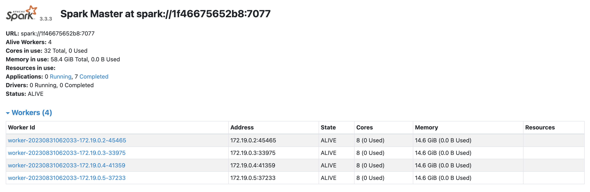
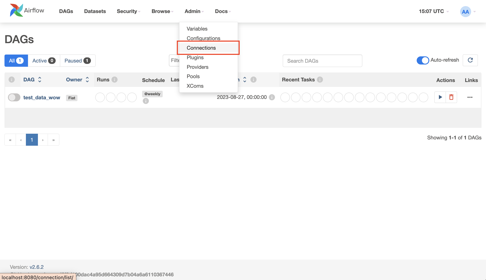
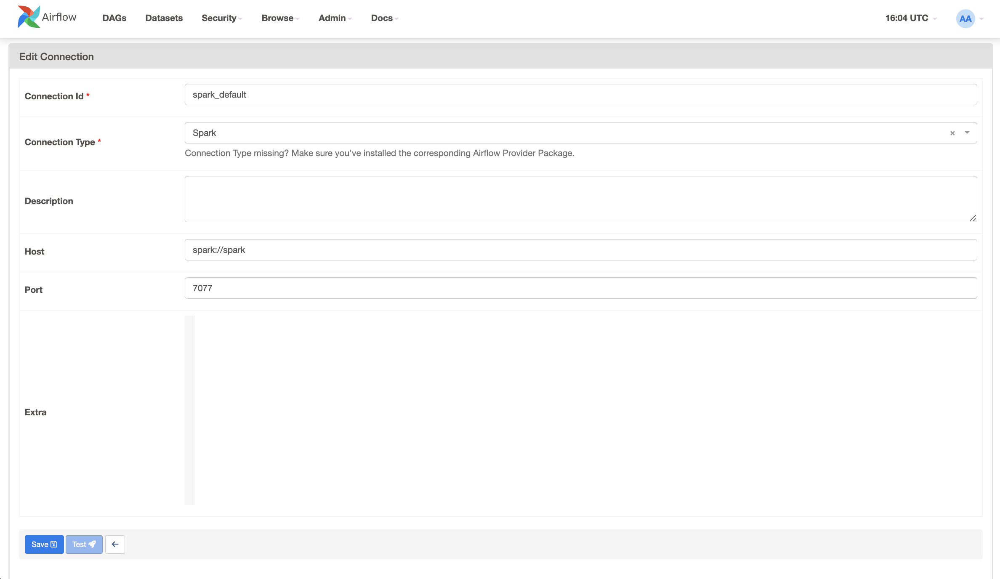

# Airflow & Spark: Running spark and airflow on Docker.
Hello everyone! my name is Fiat and this is my docker setup for running Airflow and Spark on Docker.
You guys can follow my steps for installation.

### Steps overview:
- Clone this repository
- Build Airflow and Spark images
- Customize your spark worker as you wish
  - (optional) If you customize spark worker, you also have to customize dag config for "SparkSubmitOperator" too
- Start both containers
- Run test dags on airflow webserver!

**Build the Spark image.**
```
docker build -f Dockerfile.spark . -t spark-cluster
```
**Build the Airflow image.**
```
docker build -f Dockerfile.airflow . -t airflow-spark
```
**Create necessary folders and echo AIRFLOW UID to ".env" file.**
```
mkdir ./dags ./logs ./plugins
echo -e "AIRFLOW_UID=$(id -u)\nAIRFLOW_GID=0" > .env
```
**Create external network, granting containers able to communicate.**
```
docker network create custom_network
```
**Start and run the Spark and Airflow containers.**
```
docker-compose -f docker-compose.spark.yaml -f docker-compose.airflow.yaml up -d
```
## Started container!!
After running all process sucessfully, open Airflow webserver and Spark server UI. (Click link below, if you didn't change any ports)

- For Airflow webserver:
[localhost:8080](http://localhost:8080/)

- For Spark server UI:
[localhost:8090](http://localhost:8080/)

- For username & password (If you didn't change anything)
  - username: airflow
  - password: airflow

*Your Airflow UI should look like this:*


*Your Spark UI should look like this:*


### ***After everything works fine, get through our airflow connection...***

Click on Admin > Connections > " + " button


Fill out this part same as me > and Click "save" button


## Run dags via Airflow webserver

Just click on trigger button, as you can see in this image:


If all works fine all files should imported to postgresql

**Command for checking tables on Postgresql (run on your editor)**

First exec docker,
```
docker exec -it test_data_wow-airflow-scheduler-1 bash
```
Then use this command to get in to database
```
psql -h postgres -U airflow -d postgres
```
The password for database: airflow

Check if airflow could communicate to airflow
```
nc -zv spark_container_name 7077
```
spark-submit \
    --master spark://spark-master:7077 \
    --executor-memory 2g \
    --executor-cores 2 \
    --total-executor-cores 8 \
    --driver-memory 2g \
    --driver-cores 1 \
    --jars /opt/bitnami/spark/jars/postgresql-42.6.0.jar \
    /opt/bitnami/spark/app/local_to_postgres_pyspark.py
# ENJOY!